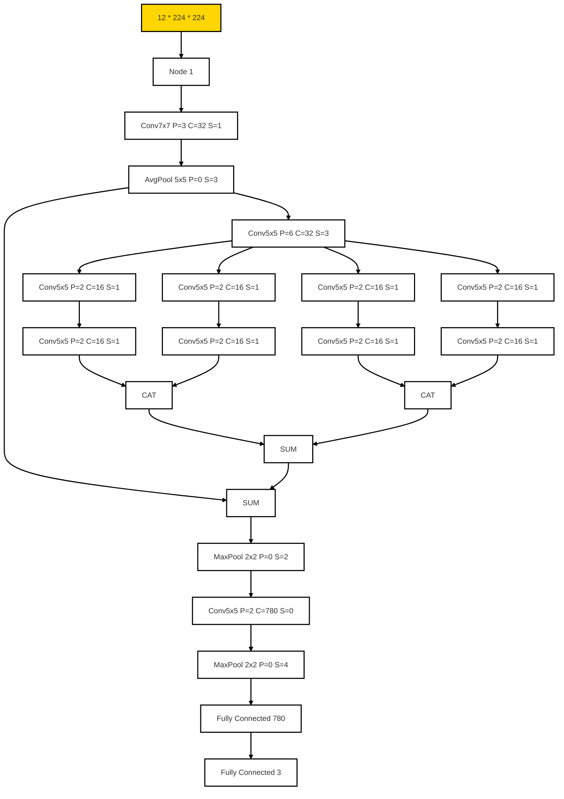

## 1. REQUIREMENT
1. **Python 3.10+**
1. **Poetry**

## 2. Installation
### 2.1 Install pipx
[pipx Document](https://pipx.pypa.io/stable/installation/)

- **On Windows**

Install via pip (requires pip 19.0 or later)

``` powershell 
py -m pip install --user pipx
```

move to <USER folder>\AppData\Roaming\Python\Python3x\Scripts

``` powershell
.\pipx.exe ensurepath
```
This will add both the above-mentioned path and the %USERPROFILE%\.local\bin folder to your search path. Restart your terminal session and verify that pipx runs correctly.

### 2.2 Installing Poetry
[Poetry Document](https://python-poetry.org/docs/#installing-with-pipx)
``` powershell
pipx install poetry
```

### 2.3 Config Poetry to create venv at root
run this command to make poetry to create venv at root
``` powershell
poetry config virtualenvs.in-project true
```

### 2.4 Installing dependencies
move to root project
``` powershell
poetry install
```

### 2.5 Access the venv
``` powershell
poetry shell
```

### 2.6 Run

``` powershell
py Model_1.py
```


### 3 Moddel architecture
Model 1


Model 2



